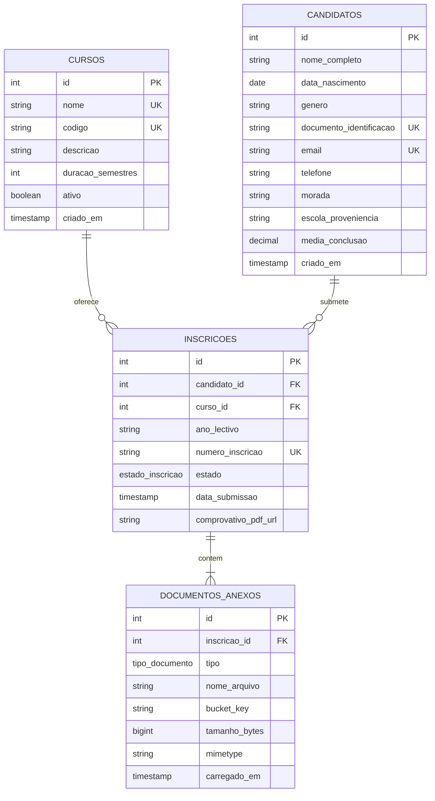
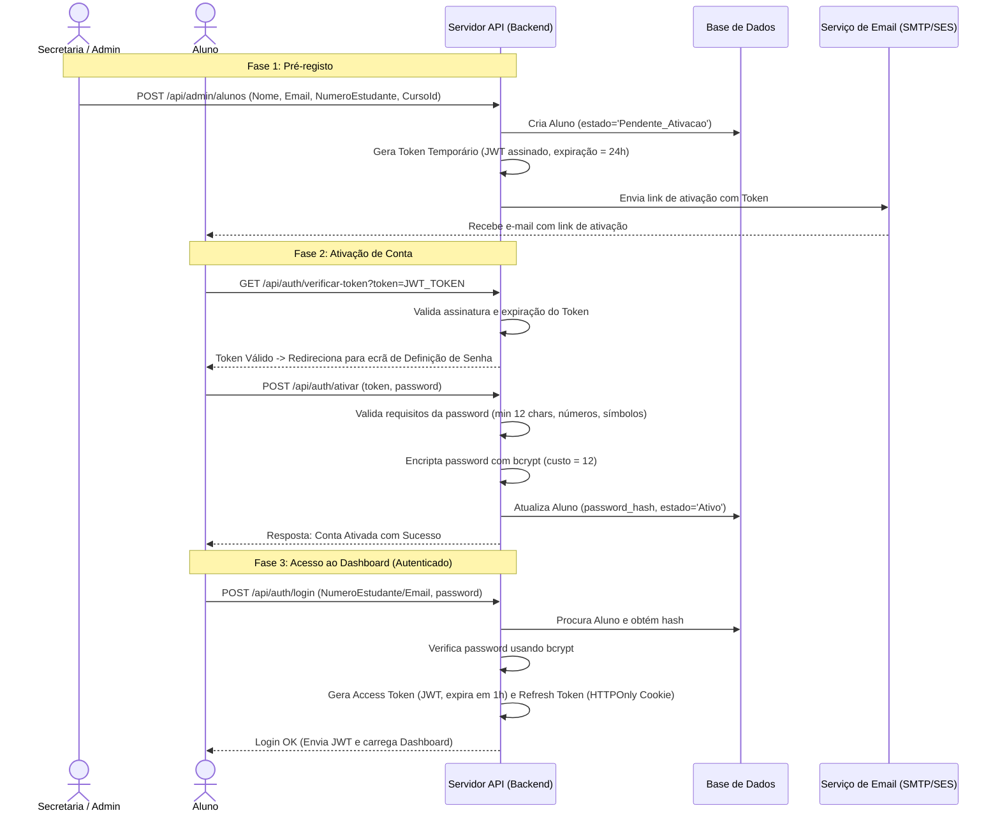

# Documentação de Arquitetura e Especificação Técnica
## Instituto Politécnico de Administração e Serviços Santa Lúcia

Este documento descreve a arquitetura de informação, o design de experiência do utilizador (UX/UI), a modelação da base de dados e a arquitetura de software para o portal e sistemas internos do **Instituto Politécnico Santa Lúcia**.

---

## 1. Arquitetura de Informação e UX/UI (Sitemap & Wireframe)

### 1.1. Sitemap (Mapa do Site) e Estrutura de Menus

O sitemap foi desenhado para equilibrar as necessidades de comunicação pública com os portais de serviços da instituição, proporcionando uma navegação fluida para candidatos, estudantes e docentes.

```
[Portal Público Santa Lúcia]
 ├── Home (Página Principal)
 │    ├── Slider com Destaques Dinâmicos
 │    ├── Visão Geral & Missão da Instituição
 │    └── Acessos Rápidos (Candidaturas, Portal do Aluno, Cursos, Biblioteca)
 ├── O Instituto
 │    ├── História e Missão
 │    ├── Corpo Docente (Filtros por Departamento)
 │    ├── Certificações e Reconhecimentos
 │    └── Contactos & Localização
 ├── Cursos
 │    ├── Informática de Gestão (Perfil, Saídas Profissionais, Grade Curricular)
 │    ├── Contabilidade e Gestão (Perfil, Saídas Profissionais, Grade Curricular)
 │    └── Finanças (Perfil, Saídas Profissionais, Grade Curricular)
 ├── Inscrições Online (Portal de Candidaturas)
 │    ├── Instruções e Requisitos
 │    ├── Formulário de Inscrição (Dados Pessoais + Upload de Documentos)
 │    └── Consulta de Estado da Candidatura
 ├── Eventos (Agenda Académica e Cultural)
 │    ├── Eventos Culturais (Festivais, workshops de arte, debates)
 │    └── Eventos Científicos (Conferências, simpósios, artigos)
 ├── Portal do Aluno (Área Reservada) -> Botão de Destaque no Menu
 │    ├── Login & Ativação de Conta (Ecrã Inicial)
 │    └── Painel (Dashboard) Académico (Notas, Assiduidade, Propinas, Matrículas)
 └── Contactos (Rodapé e Página Dedicada)
      └── Telefone Principal: +244 944405037
```

#### Menu de Navegação Principal (Header):
*   **Logo** (Instituto Politécnico Santa Lúcia)
*   **Início** (Link para a Home)
*   **O Instituto** (Menu de opções/Dropdown: História, Corpo Docente, Certificações)
*   **Cursos** (Dropdown: Informática de Gestão, Contabilidade e Gestão, Finanças)
*   **Inscrições** (Link direto para candidaturas)
*   **Eventos** (Link para a agenda filtrável)
*   **Contactos** (Link para secção/página dedicada)
*   **Portal do Aluno** (Botão de Ação com Estilo Destacado / CTA)

---

### 1.2. Estrutura de Wireframe Recomendada para a Página Inicial (Home)

A estrutura abaixo garante um design limpo, institucional e otimizado para dispositivos móveis (mobile-first):

1.  **Header (Fixado / Sticky)**:
    *   Logotipo da Instituição (Esquerda).
    *   Menu de navegação e botão destacado do "Portal do Aluno" (Direita). No telemóvel, recolhe num menu Hambúrguer expansível lateralmente com transição suave.
2.  **Hero Section / Slider de Destaques**:
    *   Carrossel dinâmico com 3 slides principais de alta resolução (Ex: Inscrições Abertas, Novo Laboratório de TI, Próximo Simpósio Científico).
    *   Botões de Chamada para Ação (CTAs): "Inscrever-me" (Primário) e "Conhecer Cursos" (Secundário).
3.  **Seção de Acessos Rápidos (Quick Access Cards)**:
    *   Grade de 4 cartões com ícones vetoriais:
        *   `Candidaturas Online` | `Portal do Aluno` | `Secretaria Virtual` | `Agenda de Eventos`.
4.  **Apresentação e Missão**:
    *   Texto sobre o compromisso com o ensino politécnico e os pilares de desenvolvimento tecnológico e de serviços.
    *   Gráficos estatísticos de sucesso (ex: % empregabilidade, número de docentes doutorados, laboratórios ativos).
5.  **Área de Destaque dos Cursos**:
    *   3 cartões estilizados representando os cursos principais: *Informática de Gestão*, *Contabilidade e Gestão*, e *Finanças*. Cada cartão mostra o perfil sumário e um link "Ver Mais Detalhes".
6.  **Seção Dinâmica de Eventos & Notícias**:
    *   Grade de 3 cartões mostrando os eventos mais próximos, com etiquetas visuais claras (`Científico` ou `Cultural`).
    *   Filtro rápido (`Todos` | `Científicos` | `Culturais`) para exploração instantânea.
7.  **Footer (Rodapé Institucional)**:
    *   Coluna 1: Logótipo, resumo institucional e redes sociais.
    *   Coluna 2: Links rápidos de navegação interna.
    *   Coluna 3: Contactos oficiais (E-mail, Morada e Telefone em destaque: `+244 944405037`).
    *   Coluna 4: Horário de atendimento presencial e selos de acreditação ministerial.

---

## 2. Arquitetura Técnica do Módulo de Inscrições Online

Para suportar os picos de tráfego massivo típicos do período de candidaturas sem degradação do serviço, a arquitetura deve separar a receção das inscrições do processamento pesado.

### 2.1. Modelo Entidade-Relacionamento (ER) Relacional

A base de dados será construída em **PostgreSQL** para garantir consistência relacional (ACID), alta concorrência concorrente sob isolamento de transações, e suporte à integridade referencial.

#### Estrutura das Tabelas (SQL DDL):

```sql
-- 1. Tabela de Cursos
CREATE TABLE cursos (
    id SERIAL PRIMARY KEY,
    nome VARCHAR(150) NOT NULL UNIQUE,
    codigo VARCHAR(20) NOT NULL UNIQUE,
    descricao TEXT,
    duracao_semestres INT DEFAULT 6,
    ativo BOOLEAN DEFAULT TRUE,
    criado_em TIMESTAMP WITH TIME ZONE DEFAULT CURRENT_TIMESTAMP
);

-- Inserção dos Cursos Oficiais
INSERT INTO cursos (nome, codigo, descricao) VALUES
('Informática de Gestão', 'INF_GEST', 'Integração de sistemas computacionais com processos de negócios e gestão empresarial.'),
('Contabilidade e Gestão', 'CONT_GEST', 'Contabilidade financeira, auditoria e controle de gestão de organizações.'),
('Finanças', 'FINANCAS', 'Análise de mercados financeiros, investimentos, tesouraria e banca.');

-- 2. Tabela de Candidatos
CREATE TABLE candidatos (
    id SERIAL PRIMARY KEY,
    nome_completo VARCHAR(255) NOT NULL,
    data_nascimento DATE NOT NULL,
    genero VARCHAR(10) CHECK (genero IN ('Masculino', 'Feminino', 'Outro')),
    nacionalidade VARCHAR(100) DEFAULT 'Angolana',
    documento_identificacao VARCHAR(50) UNIQUE NOT NULL, -- BI ou Passaporte
    email VARCHAR(150) UNIQUE NOT NULL,
    telefone VARCHAR(30) NOT NULL,
    morada TEXT,
    escola_proveniencia VARCHAR(200) NOT NULL,
    media_conclusao DECIMAL(4,2) CHECK (media_conclusao >= 0 AND media_conclusao <= 20),
    criado_em TIMESTAMP WITH TIME ZONE DEFAULT CURRENT_TIMESTAMP
);

-- 3. Tabela de Inscrições
CREATE TYPE estado_inscricao AS ENUM ('Pendente', 'Em Analise', 'Aprovada', 'Rejeitada');

CREATE TABLE inscricoes (
    id SERIAL PRIMARY KEY,
    candidato_id INT REFERENCES candidatos(id) ON DELETE RESTRICT,
    curso_id INT REFERENCES cursos(id) ON DELETE RESTRICT,
    ano_lectivo VARCHAR(9) NOT NULL, -- Ex: '2026/2027'
    numero_inscricao VARCHAR(30) UNIQUE NOT NULL, -- Ex: CAND-2026-XXXX
    estado estado_inscricao DEFAULT 'Pendente',
    data_submissao TIMESTAMP WITH TIME ZONE DEFAULT CURRENT_TIMESTAMP,
    observacoes TEXT,
    comprovativo_pdf_url VARCHAR(512) -- URL no Storage para o comprovativo em PDF gerado
);

-- 4. Tabela de Documentos Anexos
CREATE TYPE tipo_documento AS ENUM (
    'BI', 
    'Certificado_Habilitacoes', 
    'Atestado_Medico', 
    'Fotografia_Passe', 
    'Comprovativo_Pagamento'
);

CREATE TABLE documentos_anexos (
    id SERIAL PRIMARY KEY,
    inscricao_id INT REFERENCES inscricoes(id) ON DELETE CASCADE,
    tipo tipo_documento NOT NULL,
    nome_arquivo VARCHAR(255) NOT NULL,
    bucket_key VARCHAR(512) NOT NULL, -- Referência física no Cloud Object Storage (ex: S3 / Cloud Storage)
    tamanho_bytes BIGINT NOT NULL,
    mimetype VARCHAR(100) NOT NULL,
    carregado_em TIMESTAMP WITH TIME ZONE DEFAULT CURRENT_TIMESTAMP,
    UNIQUE(inscricao_id, tipo) -- Garante um único ficheiro por tipo por inscrição
);

-- Índices de Otimização
CREATE INDEX idx_inscricoes_candidato ON inscricoes(candidato_id);
CREATE INDEX idx_inscricoes_curso ON inscricoes(curso_id);
CREATE INDEX idx_inscricoes_estado ON inscricoes(estado);
CREATE INDEX idx_candidatos_documento ON candidatos(documento_identificacao);
```

---

### 2.2. Diagrama de Relacionamento (Mermaid)



---

### 2.3. Fluxo de Inscrição Detalhado

```
[Utilizador/Candidato]
       │
       ▼ (Passo 1: Preenchimento de Dados Pessoais e Escolha do Curso)
[Formulário Front-End]
       │
       ▼ (Passo 2: Upload de 5 Ficheiros Obrigatórios)
[Upload Service (Assinatura S3 / Direct Upload)]
       │   - Ficheiros carregados diretamente para Object Storage com URLs assinados temporários
       │   - Reduz carga na API back-end ao evitar tráfego de binários pelo servidor de aplicação
       │
       ▼ (Passo 3: Submissão de Formulário)
[Back-End API: POST /api/candidaturas]
       │   - Valida metadados e integridade dos uploads
       │   - Cria registo em transação ACID única (Candidato -> Inscrição -> Documentos)
       │
       ▼ (Passo 4: Processamento Assíncrono / Fila de Mensagens)
[Message Broker (RabbitMQ/BullMQ)] ──► [Worker: PDF Generation Service]
                                             │
                                             ▼ (Passo 5: Geração de Comprovativo)
                                     - Cria PDF com código de barras, número e dados da candidatura
                                     - Guarda PDF no Object Storage
                                     - Atualiza `comprovativo_pdf_url` na tabela `inscricoes`
                                             │
                                             ▼ (Passo 6: Notificação)
                                     - Envia e-mail ao candidato com o PDF em anexo e confirmação
```

---

### 2.4. Estratégias de Otimização e Escalabilidade para Picos de Carga

1.  **Direct Upload para Object Storage (S3 / Google Cloud Storage)**:
    *   **Problema**: Upload de ficheiros pesados (BI, Certificados) bloqueia as threads do servidor de aplicação.
    *   **Solução**: O Front-End solicita uma URL pré-assinada de upload à API. O navegador carrega os arquivos diretamente para o Cloud Storage. A API só recebe e processa a referência em texto (`bucket_key`).
2.  **Caching e Otimização com Redis**:
    *   **Dados de Leitura Comuns**: Listas de cursos, vagas e estados de sistemas são armazenados no Redis (TTL de 1 hora).
    *   **Rate Limiting**: Utilização do Redis para limitar submissões abusivas (limite de 3 tentativas por IP/BI por minuto).
3.  **Filas e Processamento Assíncrono (Message Broker)**:
    *   A geração de PDFs de comprovativos e o envio de e-mails de confirmação são delegados para trabalhadores (*workers*) assíncronos. A API responde imediatamente `202 Accepted` ao candidato, permitindo que a infraestrutura aguente milhares de acessos concorrentes sem lentidão.
4.  **Paginação de Queries e Índices**:
    *   Todas as consultas na área administrativa e listagem de candidatos usam paginação baseada em cursor para evitar carregar milhares de linhas da base de dados simultaneamente.
    *   Uso de índices estratégicos (`B-Tree`) nos campos de pesquisa comuns (BI, E-mail, Estado).
5.  **Uso de CDN (Content Delivery Network)**:
    *   Ficheiros estáticos do portal (HTML, CSS, JS, Imagens, Fontes) são servidos a partir de nós periféricos da CDN (ex: Cloudflare), evitando que qualquer requisição de navegação pública toque no servidor de aplicação.

---

## 3. Segurança e Autenticação (Área Reservada do Aluno)

A regra de negócio crítica impede o registo livre de contas. O controlo total de acesso e integridade dos dados académicos é mantido pela secretaria da instituição.

### 3.1. Fluxo de Trabalho de Ativação e Login



---

### 3.2. Estrutura de Tabelas de Alunos e Autenticação

```sql
-- Tabela de Alunos
CREATE TYPE estado_aluno AS ENUM ('Pendente_Ativacao', 'Ativo', 'Suspenso', 'Diplomado');

CREATE TABLE alunos (
    id SERIAL PRIMARY KEY,
    numero_estudante VARCHAR(30) UNIQUE NOT NULL, -- Gerado pela secretaria
    nome_completo VARCHAR(255) NOT NULL,
    email VARCHAR(150) UNIQUE NOT NULL,
    curso_id INT REFERENCES cursos(id),
    password_hash VARCHAR(255), -- Nulo enquanto pendente
    estado estado_aluno DEFAULT 'Pendente_Ativacao',
    criado_em TIMESTAMP WITH TIME ZONE DEFAULT CURRENT_TIMESTAMP,
    atualizado_em TIMESTAMP WITH TIME ZONE DEFAULT CURRENT_TIMESTAMP
);

-- Tabela de Atividade Académica (para o Dashboard)
CREATE TABLE notas (
    id SERIAL PRIMARY KEY,
    aluno_id INT REFERENCES alunos(id) ON DELETE CASCADE,
    disciplina VARCHAR(100) NOT NULL,
    nota_final DECIMAL(4,2) CHECK (nota_final >= 0.00 AND nota_final <= 20.00),
    ano_lectivo VARCHAR(9) NOT NULL,
    semestre INT CHECK (semestre IN (1, 2))
);

CREATE TABLE assiduidade (
    id SERIAL PRIMARY KEY,
    aluno_id INT REFERENCES alunos(id) ON DELETE CASCADE,
    disciplina VARCHAR(100) NOT NULL,
    aulas_totais INT NOT NULL,
    faltas INT NOT NULL CHECK (faltas <= aulas_totais),
    percentagem_presenca DECIMAL(5,2) GENERATED ALWAYS AS (((aulas_totais - faltas)::DECIMAL / aulas_totais) * 100) STORED
);

CREATE TABLE propinas (
    id SERIAL PRIMARY KEY,
    aluno_id INT REFERENCES alunos(id) ON DELETE CASCADE,
    mes_referencia VARCHAR(30) NOT NULL,
    valor DECIMAL(10,2) NOT NULL,
    pago BOOLEAN DEFAULT FALSE,
    data_pagamento TIMESTAMP WITH TIME ZONE,
    comprovativo_transacao VARCHAR(100)
);

CREATE TABLE matriculas_disciplinas (
    id SERIAL PRIMARY KEY,
    aluno_id INT REFERENCES alunos(id) ON DELETE CASCADE,
    disciplina VARCHAR(100) NOT NULL,
    turma VARCHAR(20) NOT NULL,
    periodo VARCHAR(20) CHECK (periodo IN ('Manhã', 'Tarde', 'Noite'))
);
```

---

### 3.3. Pseudocódigo dos Endpoints da API (Segurança)

Abaixo está o pseudocódigo para tratamento das operações de ativação e login utilizando a especificação JWT.

#### 1. Endpoint de Pré-registo do Aluno (Apenas Secretaria)
```typescript
// POST /api/admin/alunos
async function preRegistarAluno(req, res) {
    const { nome, email, numeroEstudante, cursoId } = req.body;
    
    // 1. Autorização (Apenas utilizadores administrativos/secretaria)
    if (!req.user || req.user.role !== 'Secretaria') {
        return res.status(403).json({ erro: "Não autorizado." });
    }

    try {
        // 2. Criar utilizador com senha nula e estado pendente
        const novoAluno = await db.query(
            `INSERT INTO alunos (numero_estudante, nome_completo, email, curso_id, estado)
             VALUES ($1, $2, $3, $4, 'Pendente_Ativacao') RETURNING id`,
            [numeroEstudante, nome, email, cursoId]
        );

        // 3. Gerar Token de Ativação Temporário (JWT assinado com segredo interno)
        // Payload contém o ID do aluno e o propósito. Expiração curta (24 horas).
        const activationToken = jwt.sign(
            { alunoId: novoAluno.id, acao: 'ativacao_conta' },
            process.env.JWT_ACTIVATION_SECRET,
            { expiresIn: '24h' }
        );

        // 4. Enviar e-mail de ativação via serviço de envio (ex: NodeMailer/SES)
        const activationLink = `https://santalucia.edu.ao/ativar-conta?token=${activationToken}`;
        await emailService.sendActivationEmail(email, {
            nome: nome,
            numeroEstudante: numeroEstudante,
            link: activationLink
        });

        return res.status(201).json({ mensagem: "Aluno pré-registado e e-mail de ativação enviado com sucesso." });
    } catch (error) {
        return res.status(500).json({ erro: "Erro ao processar pré-registo.", detalhe: error.message });
    }
}
```

#### 2. Endpoint de Ativação de Conta (Público, requer Token)
```typescript
// POST /api/auth/ativar
async function ativarConta(req, res) {
    const { token, password } = req.body;

    if (!token || !password) {
        return res.status(400).json({ erro: "Token e palavra-passe são obrigatórios." });
    }

    // 1. Validar força da senha
    const regexSenhaForte = /^(?=.*[a-z])(?=.*[A-Z])(?=.*\d)(?=.*[@$!%*?&])[A-Za-z\d@$!%*?&]{12,}$/;
    if (!regexSenhaForte.test(password)) {
        return res.status(400).json({ 
            erro: "A palavra-passe deve conter pelo menos 12 caracteres, incluindo maiúsculas, minúsculas, números e caracteres especiais." 
        });
    }

    try {
        // 2. Verificar e descodificar o JWT de ativação
        const decoded = jwt.verify(token, process.env.JWT_ACTIVATION_SECRET);
        
        if (decoded.acao !== 'ativacao_conta') {
            return res.status(400).json({ erro: "Token inválido para esta operação." });
        }

        // 3. Verificar se o aluno ainda está pendente na BD
        const aluno = await db.query("SELECT * FROM alunos WHERE id = $1", [decoded.alunoId]);
        if (!aluno || aluno.estado !== 'Pendente_Ativacao') {
            return res.status(400).json({ erro: "Conta já ativada ou inexistente." });
        }

        // 4. Encriptar a nova palavra-passe com Bcrypt (salt rounds = 12)
        const passwordHash = await bcrypt.hash(password, 12);

        // 5. Atualizar registo na base de dados para "Ativo"
        await db.query(
            `UPDATE alunos 
             SET password_hash = $1, estado = 'Ativo', atualizado_em = NOW() 
             WHERE id = $2`,
            [passwordHash, decoded.alunoId]
        );

        return res.status(200).json({ mensagem: "Conta ativada com sucesso! Prossiga para o login." });
    } catch (error) {
        if (error.name === 'TokenExpiredError') {
            return res.status(401).json({ erro: "O link de ativação expirou (limite de 24 horas). Contacte a secretaria." });
        }
        return res.status(400).json({ erro: "Token inválido ou adulterado." });
    }
}
```

#### 3. Endpoint de Login de Aluno
```typescript
// POST /api/auth/login
async function loginAluno(req, res) {
    const { identificador, password } = req.body; // identificador pode ser o e-mail ou o número de estudante

    try {
        // 1. Procurar o aluno pelo email ou número
        const queryResult = await db.query(
            `SELECT * FROM alunos 
             WHERE (email = $1 OR numero_estudante = $1)`, 
            [identificador]
        );
        const aluno = queryResult.rows[0];

        if (!aluno) {
            return res.status(401).json({ erro: "Credenciais inválidas." });
        }

        // 2. Verificar o estado da conta
        if (aluno.estado === 'Pendente_Ativacao') {
            return res.status(403).json({ erro: "Esta conta ainda não foi ativada. Aceda ao link enviado para o seu e-mail." });
        }
        if (aluno.estado === 'Suspenso') {
            return res.status(403).json({ erro: "Conta suspensa administrativamente. Dirija-se à secretaria." });
        }

        // 3. Comparar hashes de palavra-passe
        const loginValido = await bcrypt.compare(password, aluno.password_hash);
        if (!loginValido) {
            return res.status(401).json({ erro: "Credenciais inválidas." });
        }

        // 4. Gerar Access Token (JWT - expiração curta de 1 hora)
        const accessToken = jwt.sign(
            { alunoId: aluno.id, numeroEstudante: aluno.numero_estudante, nome: aluno.nome_completo, role: 'Aluno' },
            process.env.JWT_ACCESS_SECRET,
            { expiresIn: '1h' }
        );

        // 5. Gerar Refresh Token (JWT - expiração longa de 7 dias)
        const refreshToken = jwt.sign(
            { alunoId: aluno.id },
            process.env.JWT_REFRESH_SECRET,
            { expiresIn: '7d' }
        );

        // 6. Armazenar o Refresh Token num Cookie HttpOnly seguro para evitar ataques XSS
        res.cookie('refreshtoken', refreshToken, {
            httpOnly: true,
            secure: true, // Apenas via HTTPS em produção
            sameSite: 'strict',
            maxAge: 7 * 24 * 60 * 60 * 1000 // 7 dias
        });

        // 7. Retornar dados básicos do aluno e o Access Token para armazenamento em memória no SPA
        return res.status(200).json({
            token: accessToken,
            aluno: {
                id: aluno.id,
                numeroEstudante: aluno.numero_estudante,
                nome: aluno.nome_completo,
                email: aluno.email
            }
        });
    } catch (error) {
        return res.status(500).json({ erro: "Erro no servidor ao tentar efetuar login." });
    }
}
```

---

## 4. Especificação Técnica do Módulo de Eventos

O módulo de eventos suporta a dinâmica cultural e científica do Instituto Politécnico Santa Lúcia, permitindo a separação de categorias e a submissão digital de contribuições académicas.

### 4.1. Definição Visual das Categorias de Eventos

1.  **Eventos Culturais (Identidade Visual Quente / Dinâmica)**:
    *   *Tipos*: Festivais, workshops de artes visuais, debates, concertos da comunidade e feiras de gastronomia académica.
    *   *Estilo*: Cores vibrantes (laranja/ouro), tipografia descontraída, ênfase em galerias fotográficas e cronograma de atividades.
2.  **Eventos Científicos (Identidade Visual Sóbria / Académica)**:
    *   *Tipos*: Conferências internacionais, simpósios de informática de gestão, palestras de finanças e publicação de artigos científicos.
    *   *Estilo*: Azul escuro, estruturas limpas em formato de agenda de blocos de pesquisa, botões para descarregar o "Edital" e secções para submissão digital de artigos.

---

### 4.2. Fluxo Administrativo (CMS Simplificado)

A secretaria possui um painel simples baseado em formulários para gerir a agenda sem necessidade de intervenção técnica:

*   **Campos de Entrada obrigatórios**:
    *   `Título` (Texto curto)
    *   `Categoria` (Seleção: "Cultural" ou "Científico")
    *   `Data e Hora` (Data/Hora de início e fim)
    *   `Local` (Ex: "Auditório Principal", "Sala de Informática 3")
    *   `Oradores/Painelistas` (Lista de nomes separados por vírgula)
    *   `Imagem de Capa` (Upload ou URL de imagem institucional)
    *   `Descrição Detalhada` (Texto descritivo)
    *   `Possui Edital / Submissão?` (Apenas para Científicos - Ativa os campos de upload do Edital em PDF e aceitação de artigos).

---

### 4.3. Fluxo de Submissão de Resumos Científicos (PDF)

Para as conferências e simpósios, investigadores e estudantes utilizam o formulário de submissão integrado na página do evento científico:

1.  **Acesso**: O utilizador navega até um Evento Científico e clica em **"Submeter Artigo/Resumo"**.
2.  **Formulário**: Pede dados de contacto do autor principal, coautores, título do artigo e um campo de upload exclusivo para ficheiros PDF (limite de 10MB).
3.  **Processamento**:
    *   Validação do ficheiro no front-end (apenas `.pdf`).
    *   A API recebe o arquivo, gera um identificador único de submissão (ex: `SUB-ART-2026-XXXX`) e armazena o ficheiro no diretório de submissões académicas da instituição.
    *   O autor recebe uma notificação imediata no ecrã e por e-mail com a confirmação de receção e o código de acompanhamento.
